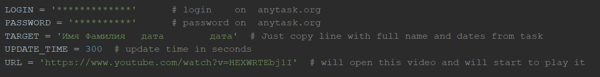
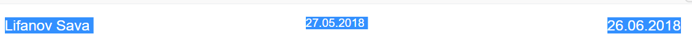
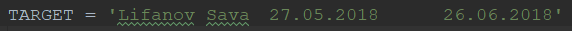

# Anytask_Checker
Проверяeт слетел ли человек с таска на сайте anytask.org, курс УрФУ > python.task
Предполагается, что вы будете этим пользоваться в день, когда у человека слетает задача которая вас интересует.
Если человек слетел, то скрипт откроет anytask в браузере что бы вы записались на задачу.
Так же, он откроет ссылку с видео/музыкой что бы предупредить вас.

## Установка
Скачай репозиторий и выполни команду в терминале:
```bash
pip install -r requirements.txt
```
## Настройка и запуск

LOGIN - ваш логин на anytask.org
PASSWORD - ваш пароль на anytask.org
UPDATE_TIME - обновлять страницу раз в UPDATE_TIME секунд
URL - страница, которая откроется после того как человек слетел с таска. Лучше использовать видео со звуком.

TARGET - сюда надо скопировать строку с именем, фамилиией, датами со страницы курса.
Ctrl-c

Ctrl-v


После настройки запускаем из терминала командой:
```bash
python anytask.py
```
